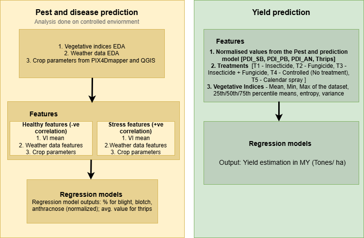
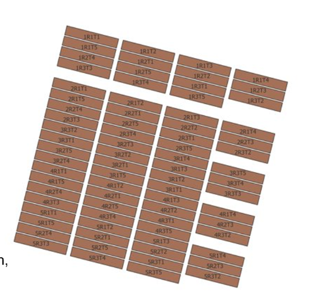

# BRANCHES
**main** branch contains preliminary codes  
**eda_dogr** branch contains codes for eda done on vegetative indices  
**feature_extraction** brach contains codes of regression model implementation for vegetative indices   
**weather_data** branch contains codes for EDA done on weather data, correlation matrix calculation, and regression models trained on weather data  

# INDICES
[Indices](https://docs.google.com/spreadsheets/d/1KajGFBLdNTg6N7FihxCQLv95GFzDTnZ2/edit?usp=sharing&ouid=104284351351877089975&rtpof=true&sd=true)

# Problem statement

# DOGR field layout

# Weather data empirically affecting diseases found by the DOGR scientists

