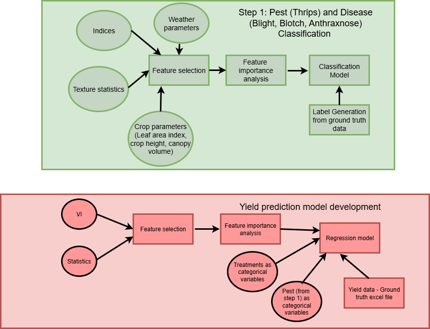
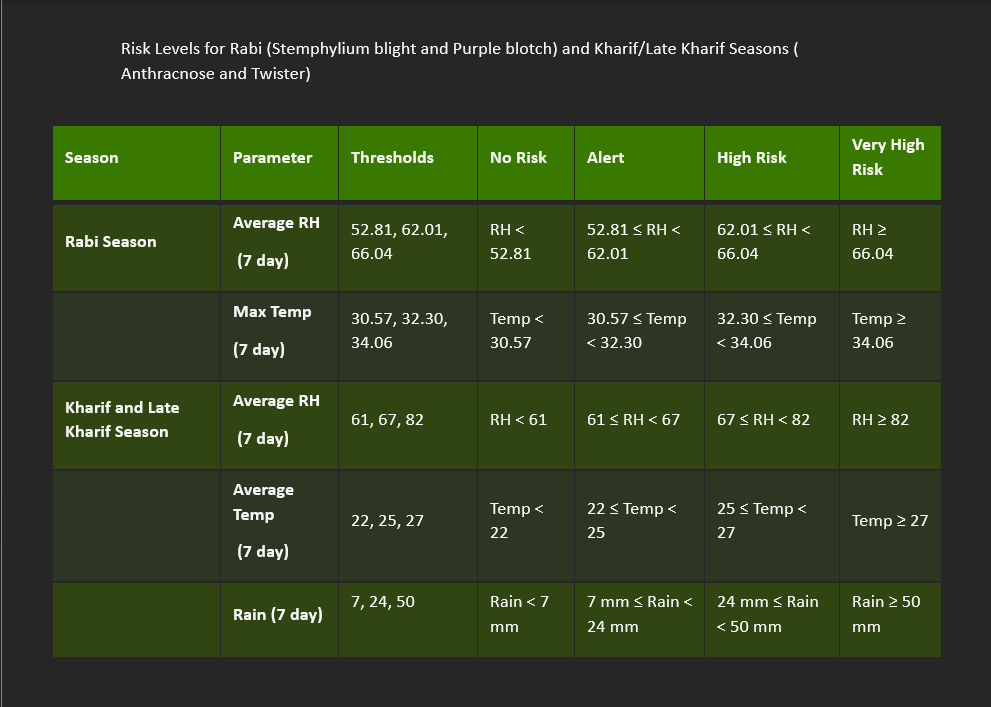

# INDICES
[Indices](https://tihiitb-my.sharepoint.com/:x:/g/personal/dimple_bhuta_tihiitb_org/EZU9YNO-ms9U6cvh58ZcHNkB0CDYp9QhFC_kQudNnp_Ckg?e=YHepXr)

# Problem statement

# Weather data empirically affecting diseases found by the DOGR scientists

